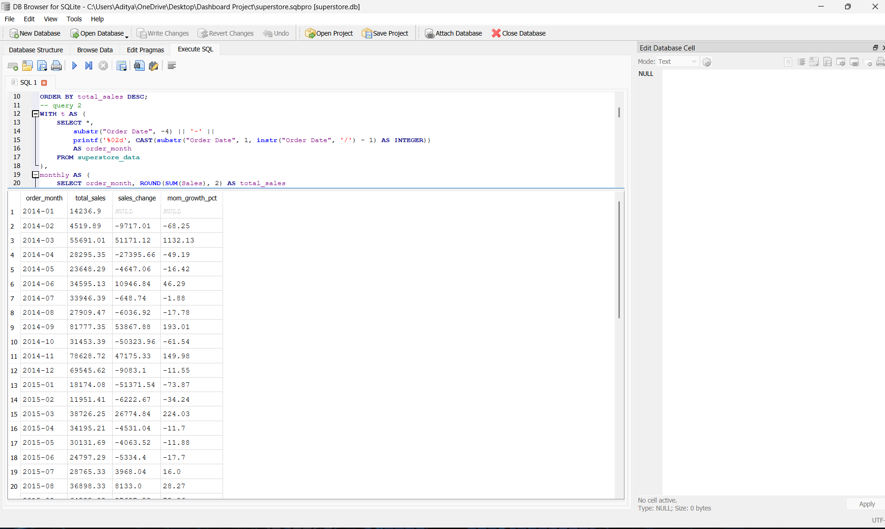
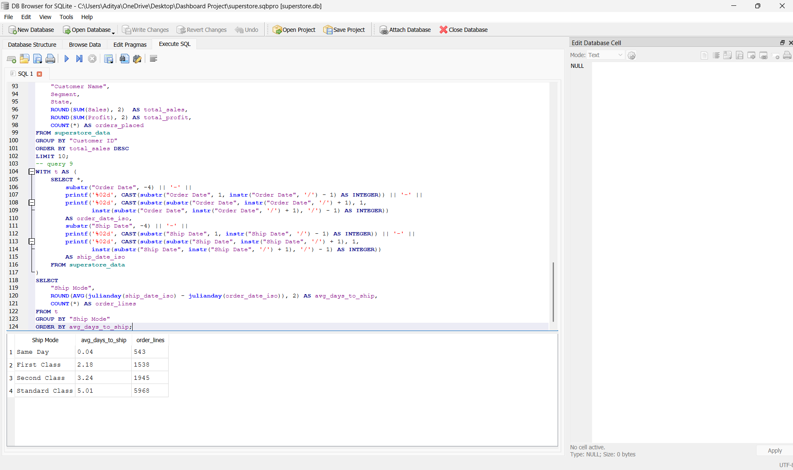
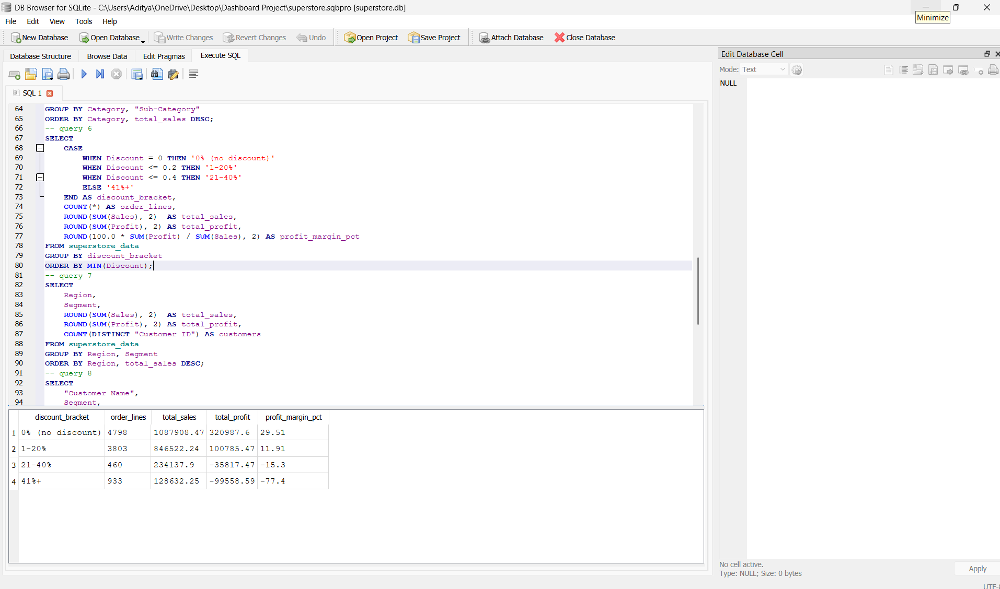
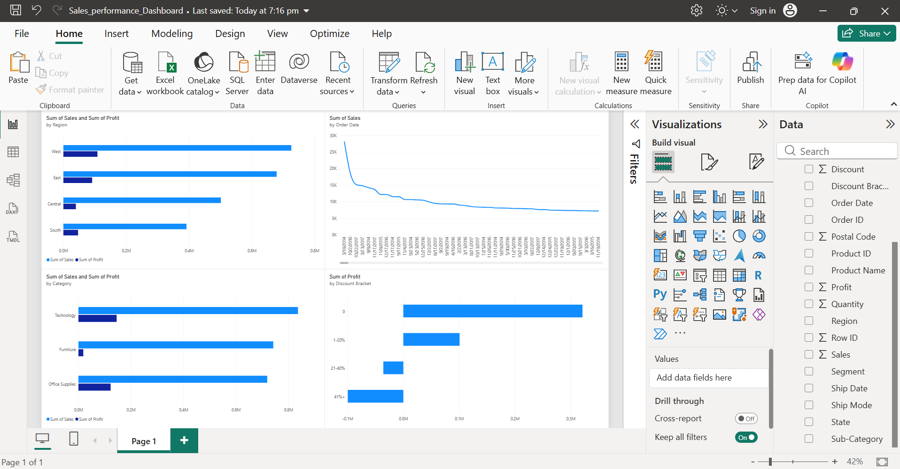

# Sales Performance Analysis — SQL & Power BI

A sales analytics project on the Superstore dataset (9,994 transactions, 2014–2017), using SQL for data analysis and Power BI for visualization.

## The Data

- **Source:** Superstore retail dataset — orders, customers, products, sales, profit, and discount data across 4 US regions
- **Size:** 9,994 order-level rows
- **Fields:** Order/Ship dates, Region, Category, Sub-Category, Customer Segment, Sales, Profit, Discount, Quantity

## SQL Analysis

Wrote 9 queries covering aggregation (`GROUP BY`), a window function (`LAG()` for month-over-month growth), joins, and CASE-based segmentation — full queries in [`sql_queries.sql`](./sql_queries.sql).

**Month-over-month sales growth** (window function using `LAG()`):

**Shipping performance by mode** — average fulfillment time:

Same Day shipping averages same-day fulfillment (0.04 days), while Standard Class takes ~5 days on average — a useful check on whether shipping SLAs are actually being met.

**Profit margin by discount bracket** — the standout finding:

| Discount Bracket | Profit Margin |
|---|---|
| 0% (no discount) | +29.5% |
| 1–20% | +11.9% |
| 21–40% | −15.3% |
| 41%+ | **−77.4%** |

Orders discounted above 40% are sold at a steep loss — a clear signal for reviewing discount approval policy.

## Power BI Dashboard

Built a 4-chart dashboard (Sales & Profit by Region, Monthly Sales Trend, Sales & Profit by Category, Profit by Discount Bracket) from the same dataset:

## Key Insight

Heavy discounting (41%+) is the single biggest driver of unprofitable orders in this dataset, turning a healthy ~30% margin into a ~77% loss. This kind of finding is exactly what a discount-approval policy review would use as evidence.

## Tools Used

- **SQL** (SQLite via DB Browser) — data querying, window functions, joins
- **Power BI Desktop** — dashboard and visualization

## Files in This Repo

- `sql_queries.sql` — all 9 SQL queries
- `superstore_data.csv` — the raw dataset
- `Sales_Performance_Dashboard.pbix` — Power BI project file
- Screenshots — SQL query results and dashboard view
